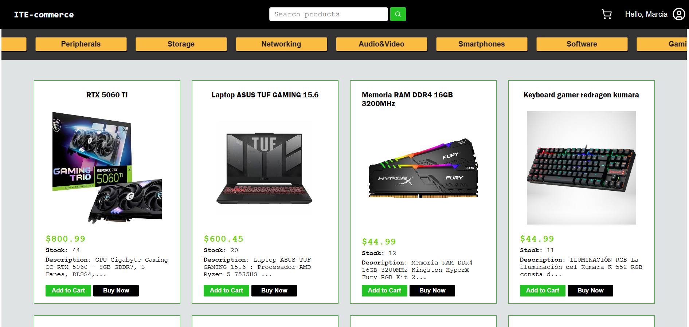
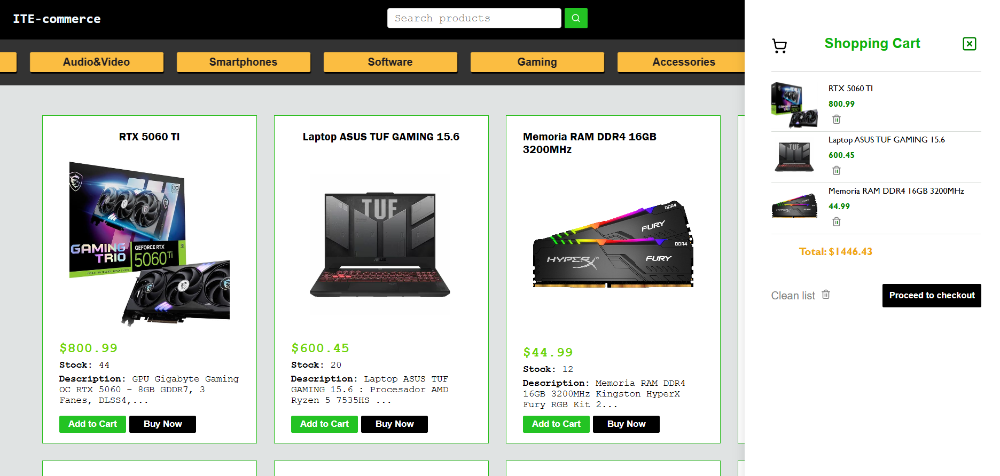
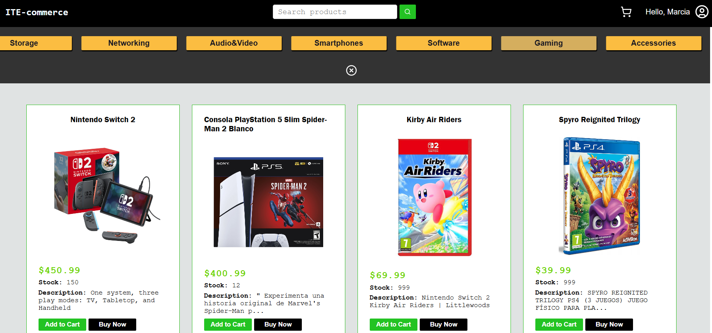
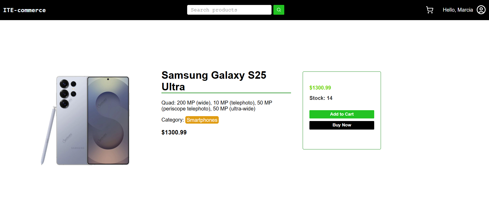
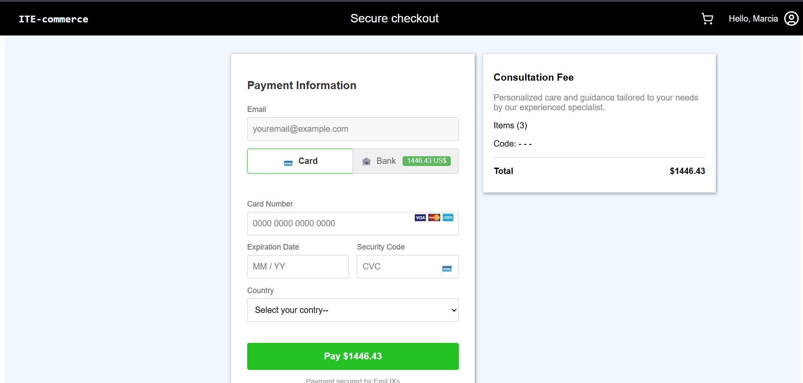
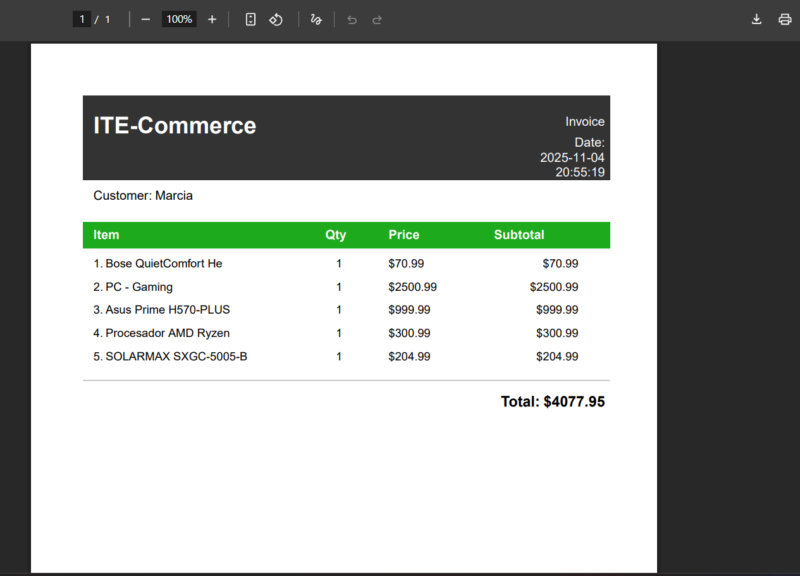
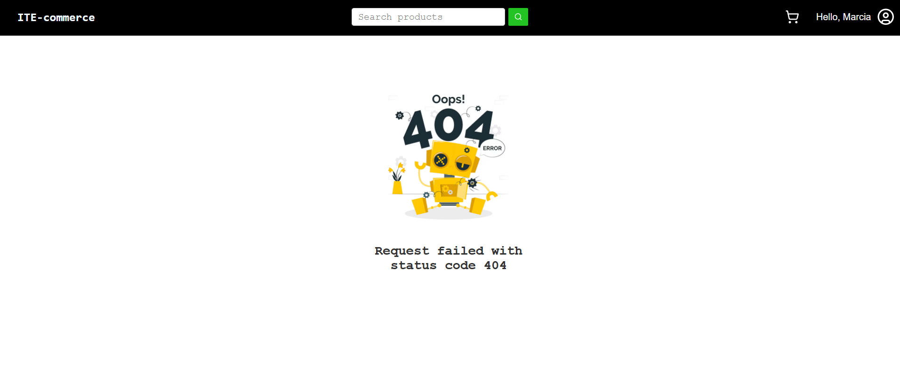

# ITE-Commerce

This project is an e-commerce platform with features such as listing products from a database and managing them dynamically from various endpoints, enabling full CRUD operations.

### Main view

### Cart list

### Filter

### Products details

### Bill view

### Invoice example

### Error 404

